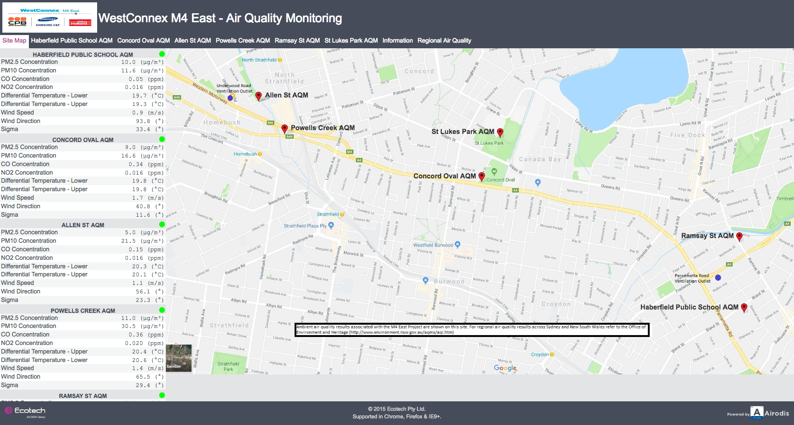
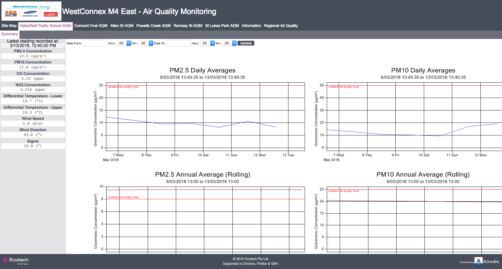
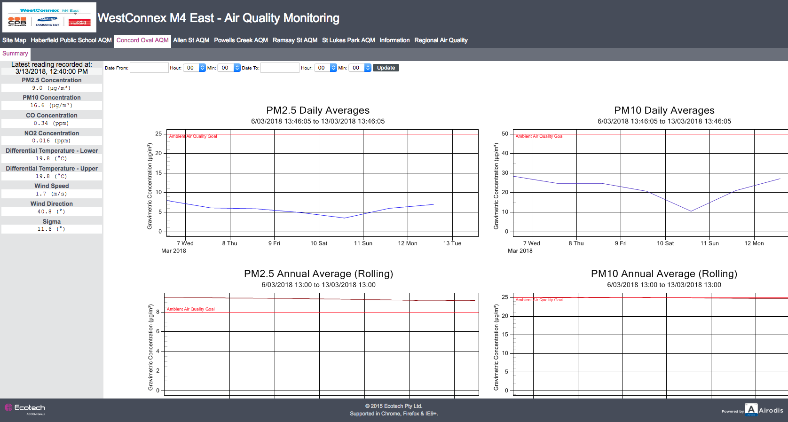
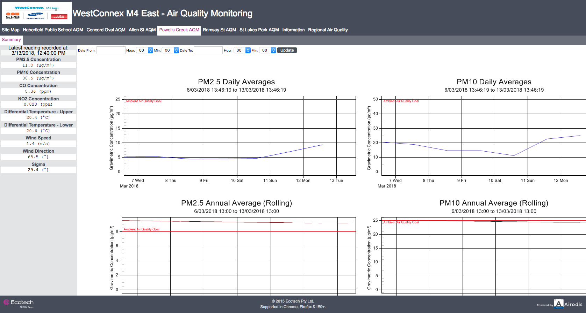
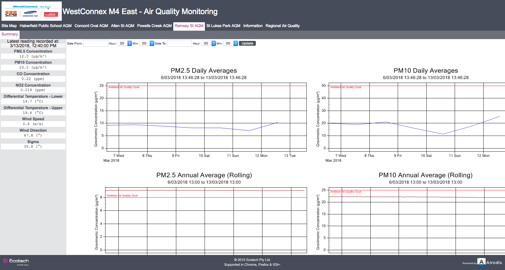
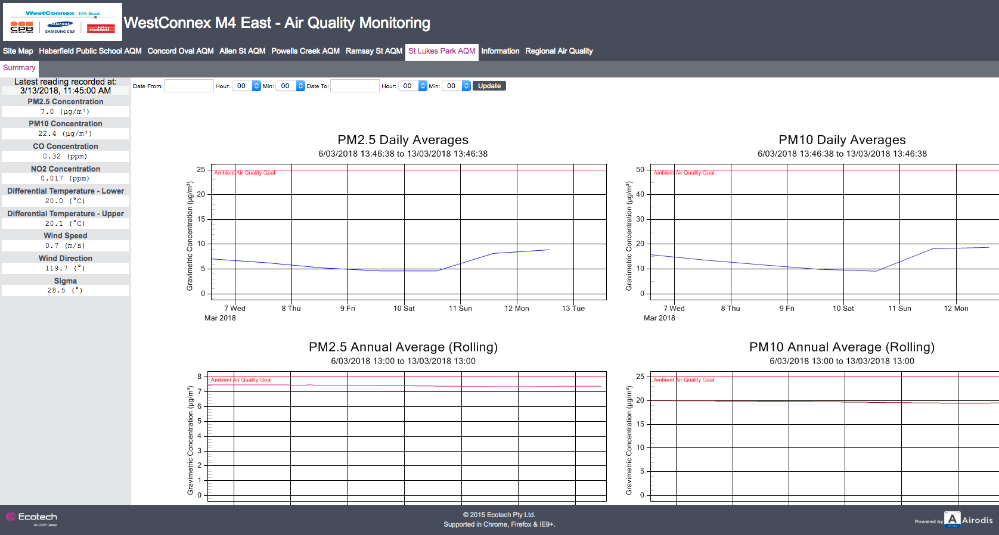

This scraper collects the information about the air quality around the
WestConnex M4 East project in Sydney, Australia.

The information is collected by a contractor for WestConnex and is published at [http://airodis.ecotech.com.au/westconnex/](http://airodis.ecotech.com.au/westconnex).
We then collect the information published there.

Here are examples of the information published:














## Records

For each record we collect:

* **location_name**, the name of the air quality monitoring station, e.g.  'Haberfield Public School AQM'
* **scraped_at**, the date and time the data was collected by us
* **latest_reading_recorded_at**, the time the website says the reading was
  recorded, in the format provided
* **pm2_5_concentration**, Particulate less that 2.5 microns in equivalent aerodynamic diameter
* **pm10_concentration**, Particulate less that 10 microns in equivalent aerodynamic diameter
* **co_concentration**, Carbon Monoxide reading
* **no2_concentration**, Nitrgen Dioxide reading
* **differential_temperature_lower**, "Differential Temperature - Lower" reading
* **differential_temperature_upper**, "Differential Temperature - Upper" reading
* **wind_speed**, Wind Speed reading
* **wind_direction**, Wind Direction reading
* **sigma**, Sigma (Wind Direction stability) reading

See the information provided below for more information about what's recorded.

## Information provided

[The Information page](http://airodis.ecotech.com.au/westconnex/index.html?site=6&station=0)
on the WestConnex M4 East - Air Quality Monitoring includes the following text,
retyped here because it is an image of text there, rendering it inaccessible to screen readers etc. :

```
Definitions & Abbreviations

PM10 Particulate less that 10 microns in equivalent aerodynamic diameter
PM2.5 Particulate less that 2.5 microns in equivalent aerodynamic diameter
N02 Nitrogen dioxide
CO Carbon monoxide
WD Vector Wind Direction
WS Vector Wind Speed
Sigma Wind Direction stability
AT Ambient Temperature

Units

µg/m³ Micrograms per cubic meter at standard temperature and pressure (0ºC and
101.3 kPa)
ppm Parts per million
º Degrees (True North)
m/s Metres per second
ªC Degrees Celsius

Traffic light icons on Site Map page side bar

The green, orange and red circles indicate that data was successfully loaded to
the page at the last attempt.
This is not an indication of the pollution index or instrument status

Instantaneous data on the side bar of individual station summary tabs

These are real-time values showing the latest available five-minute result for
each parameter. Graphs show data averaged over periods which coincide with the
relevant air quality goals. As a result, these values may differ.

Disclaimer

The data use in the compilation of this website has undergone only preliminary
quality assurance checks. This data may require modification during the final
stages of validation as a result of calibration changes, power failures,
instrument failures etc
```

## Setup

### Dependencies

* PostgreSQL
* PhantomJS

### Database setup

Replace `$password` with your own strong database password.

```
createdb westconnex_m4east_aqm_development
psql westconnex_m4east_aqm_development
> CREATE ROLE westconnex_m4east_aqm;
> ALTER ROLE westconnex_m4east_aqm WITH LOGIN PASSWORD '$password' NOSUPERUSER NOCREATEDB NOCREATEROLE;
> CREATE DATABASE westconnex_m4east_aqm_development OWNER westconnex_m4east_aqm;
> REVOKE ALL ON DATABASE westconnex_m4east_aqm_development FROM PUBLIC;
> GRANT ALL ON DATABASE westconnex_m4east_aqm_development TO westconnex_m4east_aqm;
> \q
```

When running the scrapers, add the environment varaible
DEVELOPMENT_DATABASE_PASSWORD with the same value as `$password` above, to use
the password when running the scraper. Create a file `.env` and add the
variable:

```
# .env

DEVELOPMENT_DATABASE_PASSWORD=$password
```

### Running locally

```
bundle exec dotenv ./scraper.rb
```

## Production Setup

Add Heroku PhantomJS buildpack:

```
heroku buildpacks:add --index 1 https://github.com/stomita/heroku-buildpack-phantomjs --app $heroku_app_name
```

### Running in production

The script runs in production when the `RACK_ENV` environment variable is set to
"production". This is automatically set on Heroku but you can test it locally by
running:

```
RACK_ENV=production bundle exec ./scraper.rb
```

Heroku injects it's own `ENV['DATABASE_URL']`.

### Access the production data

```
heroku pg:psql --app $heroku_app_name

> SELECT * FROM aqm_records;
```

### View the scheduler logs

You can view the logs from the [Heroku scheduler](https://devcenter.heroku.com/articles/scheduler#inspecting-output) with:

```
heroku logs --app $heroku_app_name --ps scheduler
```
