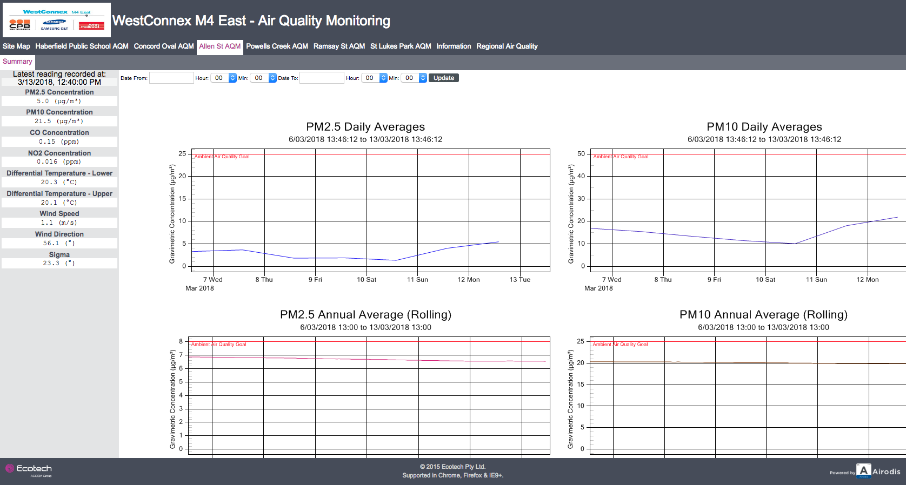

This scraper collects the information about the air quality around the
WestConnex M4 East project in Sydney, Australia.

The information is collected by a contractor for WestConnex and is published at [http://airodis.ecotech.com.au/westconnex/](http://airodis.ecotech.com.au/westconnex).
We then collect the information published there.

Here are examples of the information published:

## Dependencies

* SQLite 3
* PhantomJS
